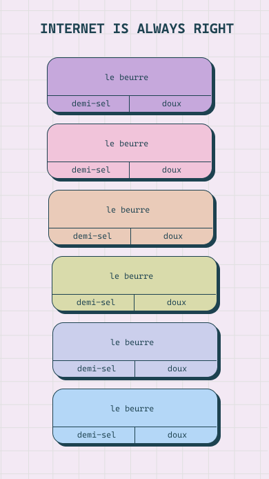

# [Internet is always right]

A series of debates that we want to settle and who could a better judge than the mighty Internet?



## Structure

```
internet-is-always-right/
  index.tsx
  types.ts
  components/
  lib/          # client helpers (e.g. getRainbowClass)
  styles/
  README.md
```

Server Mongo helpers live in `lib/iiar/` at the repo root (used by `pages/api/*`).

## Env

- `MONGO_URI` — MongoDB connection string (server-only)

## Description

Each question has two vote options. In French.

## Built with

- NextJS
- MongoDB

## [License](https://github.com/marinakinalone/le-journal/blob/main/LICENSE.txt)

CC BY-NC-SA 4.0. © [Marina Kinalone Simonnet](https://github.com/marinakinalone)
